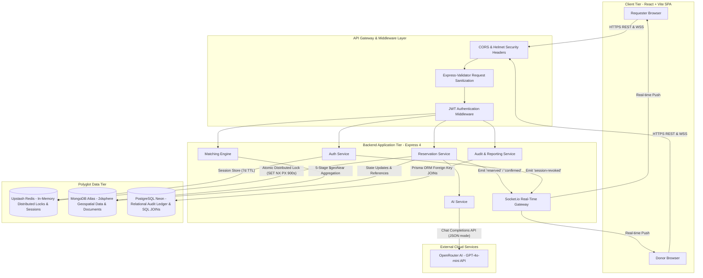
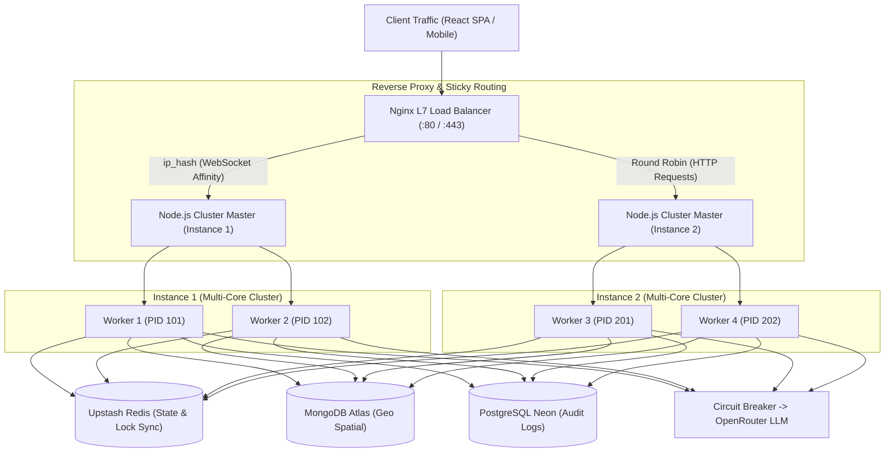

# LifeLine — High-Level Design (HLD)

> **Document Version:** 1.2.0  
> **Author:** Mayank Sharma  
> **Status:** Approved / Production-Ready  
> **Core Concept Demonstrated:** System design basics: Frontend, backend, DB and other systems integration

---

## 1. System Architecture Diagram



---

## 2. Technology Stack & Multi-System Integration

| Tier / Subsystem | Technology | Responsibility & Integration Role |
|---|---|---|
| **Frontend SPA** | React 18, Vite, TypeScript, React Router DOM v6, Tailwind CSS | Single-page client application with client-side routing, controlled forms, and reactive UI feedback. |
| **API Server** | Node.js (v20 LTS), Express 4 | Stateless RESTful micro-monolith handling authentication, input validation, matching orchestration, and error handling. |
| **Document Database** | MongoDB Atlas (Mongoose ODM) | Stores users, donor profiles, and emergency requests. Leverages native `2dsphere` indexes for high-speed spatial aggregation. |
| **Relational Ledger** | PostgreSQL (Prisma ORM) | Structured relational storage for compliance audit logs (`audit_events` JOIN `donors_reference`) with foreign key constraints. |
| **In-Memory Cache & Lock** | Upstash Redis (REST API) | High-throughput distributed locks (`SET NX PX`) for concurrent reservation serialization and server-side refresh session storage. |
| **Real-Time Layer** | Socket.io (WebSocket + Long-Polling Fallback) | Bidirectional room-based event broadcasting for live status transitions (`matched`, `reserved`, `confirmed`, `escalated`). |
| **Artificial Intelligence** | OpenRouter (OpenAI GPT-4o-mini) | Natural language extraction and match explainability, backed by deterministic regex fallbacks. |
| **DevOps & CI/CD** | GitHub Actions, Husky, Commitlint, Vercel, Render | Automated linting, test suites execution on push/PR, and production deployment automation. |

---

## 3. Subsystem Deep Dives

### 3.1 Authentication & Instant Session Revocation
LifeLine avoids stateless-only JWT security vulnerabilities (where compromised tokens cannot be revoked before natural expiration) by using a **hybrid JWT + Redis session architecture**:
1. **Short-Lived Access Token:** 15-minute JWT signed with HMAC-SHA256 containing `{ userId }`, passed in the HTTP `Authorization: Bearer <token>` header.
2. **Server-Managed Refresh Session:** A cryptographically random opaque refresh token stored in Redis under `session:<sessionId>` with a 7-day TTL, hashed with bcrypt and delivered via a `SameSite=Strict`, `httpOnly`, `secure` cookie.
3. **Instant Revocation:** When a user clicks "Logout" or changes credentials, the backend deletes the Redis key and emits a `session-revoked` event over Socket.io, instantly terminating all open client tabs.

### 3.2 Geospatial Matching Engine
The matching engine executes in MongoDB rather than Node.js memory to minimize network overhead and leverage native spatial B-trees:
- Operates on the `User` collection which indexes coordinates `[longitude, latitude]` with a `2dsphere` spatial index.
- Computes geodesic distance over the WGS84 ellipsoid using `$geoNear` within a 50 km spherical radius.
- Performs an embedded `$lookup` join to `DonorProfile`, filtering on `status == 'available'` and blood compatibility.
- Sorts by distance ascending and reliability score descending, projecting the top 10 candidates.

### 3.3 Atomic Reservation & Distributed Locking
The core system design guarantee is **zero double bookings under concurrent load**:
- When a requester reserves donor $D_1$ for request $R_1$, the server invokes:
  ```redis
  SET lock:donor:D1 R1 NX PX 900000
  ```
- **Atomicity:** Because Redis executes commands in a single-threaded event loop, `SET NX` (Set if Not Exists) is strictly atomic.
- If request $R_2$ attempts to reserve donor $D_1$ at the same millisecond, Redis returns `null`. The backend intercepts this and returns HTTP `409 Conflict`.
- **Fault-Tolerance:** If the reserving client crashes or disconnects, the lock automatically expires after 900,000 milliseconds (15 minutes), making the donor available for auto-escalation.

### 3.4 Polyglot Persistence Architecture
LifeLine uses polyglot persistence to match data models to the optimal storage engine:
1. **MongoDB (Document / Spatial):** Chosen for flexible, evolving emergency intake payloads, nested escalation histories, and native `$geoNear` spatial indexing.
2. **PostgreSQL via Prisma (Relational / ACID Audit):** Chosen for regulatory audit trails. Audit records require strict foreign key integrity (`donorId -> DonorReference.id` with `ON DELETE SET NULL`) and relational `LEFT JOIN` queries for audit verification screens.

### 3.5 Advisory AI Architecture with Deterministic Fallbacks
The AI layer enhances user experience without becoming a single point of failure:
- **Intake Parsing:** OpenRouter is invoked with `response_format: { type: 'json_object' }` and an 8-second `AbortController` timeout.
- **Circuit Breaker / Fallback:** If the API times out, returns HTTP 4xx/5xx, or returns malformed JSON, the service seamlessly routes through `parseEmergencyTextFallback()` using deterministic regex pattern matching for blood groups and urgency keywords.

---

## 4. Key Architectural Trade-Offs

| Decision | Selected Approach | Alternative Considered | Engineering Rationale |
|---|---|---|---|
| **Database Strategy** | Polyglot Persistence (MongoDB + PostgreSQL) | Single Database (Mongo only or SQL only) | Combines MongoDB's native 2dsphere spatial index with PostgreSQL's relational foreign keys and SQL JOIN audit reporting. |
| **Concurrency Control** | Redis `SET NX PX` Distributed Lock | MongoDB Optimistic Concurrency (`versionKey` / `findOneAndUpdate`) | Redis provides sub-millisecond atomic locking in memory, completely decoupling concurrency locks from primary database write load. |
| **Session Model** | Short-Lived JWT (15m) + Redis Refresh Session (7d) | Stateless Long-Lived JWT | Enables instant cross-device session revocation upon logout without maintaining a permanent blocklist table. |
| **AI Integration** | Advisory with Deterministic Fallback | Direct LLM Decision Making | Ensures 100% service uptime during third-party LLM outages; medical matching rules remain strictly deterministic. |
| **Real-Time Delivery** | Socket.io Room-Based WebSocket Events | Short Polling (HTTP GET every 2s) | Eliminates repetitive HTTP connection overhead and delivers sub-50ms status updates to donors and requesters. |

---

## 5. Security & Threat Model

1. **Injection Mitigation:** 
   - Strict `express-validator` schema constraints on all endpoints.
   - Parameterized SQL queries generated by Prisma ORM prevent SQL injection.
   - Strict field whitelisting and schema validation prevent NoSQL object injection (`{ "$gt": "" }`).
2. **Transport Security:** Enforced HTTPS with TLS 1.3 in production; secure, HTTP-only, SameSite cookies for refresh sessions.
3. **Data Privacy:** Passwords hashed with bcrypt (salt factor 10); donor phone numbers and exact street addresses obfuscated until explicit confirmation.

---

## 6. Multi-System Concept Implementation Directory

| Concept | Subsystem & File | Concrete Mechanism |
|---|---|---|
| **System design basics: Integration** | `docs/HLD.md` (§2) & `server/src/app.js` | Integration of React SPA, Express API, MongoDB Atlas, PostgreSQL Neon, Upstash Redis, and Socket.io |
| **Problem modeling** | `docs/PRD.md` (§1) & `matchingService.js` | Mathematical modeling of emergency triage: $\text{Rank}(d) = \alpha \cdot \text{Distance} - \beta \cdot W_d$ |
| **Middleware** | `server/src/middleware/auth.js` | Express middleware `authenticate` verifying JWT tokens and assigning `req.userId` |
| **Client-side routing** | `client/src/App.tsx` | React Router v6 `<Routes>` with `<Route>` components, `useNavigate`, and role-based redirects |
| **JavaScript — Event loop** | `client/src/components/EmergencyFormScreen.tsx` | Microtasks (`Promise.resolve().then`) vs Macrotasks (`setTimeout(..., 0)`) in `handleSubmit` |
| **JavaScript — Hoisting** | `server/src/services/authService.js` | Module-level hoisting of `async function _createSession(user)` to permit top-level caller access |
| **React component composition** | `client/src/components/AuthScreen.tsx` | Component composition using `AuthScreenProps { onSuccess }` interface and sub-tree components |
| **State management with useState** | `client/src/components/AuthScreen.tsx` | State hooks for controlled inputs, role switches, and UI feedback |
| **CRUD operations (Mongo)** | `server/src/services/authService.js` | MongoDB CRUD: `User.findOne`, `User.create`, `DonorProfile.create` |
| **Relational schema design (PK/FK)** | `server/prisma/schema.prisma` | PostgreSQL 1:N foreign key between `AuditEvent` and `DonorReference` with `onDelete: SetNull` |
| **SQL JOINs** | `server/src/services/auditService.js` | SQL `LEFT JOIN` via `prisma.auditEvent.findMany({ include: { donor: true } })` |
| **Load Balancing & Horizontal Scaling** | `server/src/cluster.js` & `nginx/nginx.conf` | Multi-process Master-Worker Cluster (`cluster.SCHED_RR`) + Nginx L7 Upstream with `ip_hash` sticky sessions |
| **Rate Limiting & Throttling** | `server/src/middleware/rateLimiter.js` | Sliding Window Rate Limiter using Redis counters, returning 429 Too Many Requests |
| **Circuit Breaker Pattern** | `server/src/utils/circuitBreaker.js` | 3-State resilience machine (Closed, Open, Half-Open) wrapping OpenRouter API calls |
| **Distributed Tracing** | `server/src/middleware/correlationId.js` | `X-Request-ID` cryptographic correlation tracing across Express pipeline and logs |
| **Health Probes & Graceful Shutdown** | `server/src/routes/health.js` & `index.js` | Dual-probe `/health/live` & `/health/ready` + `SIGTERM`/`SIGINT` graceful connection drain |

---

## 7. High-Availability & Load Balancer Architecture




