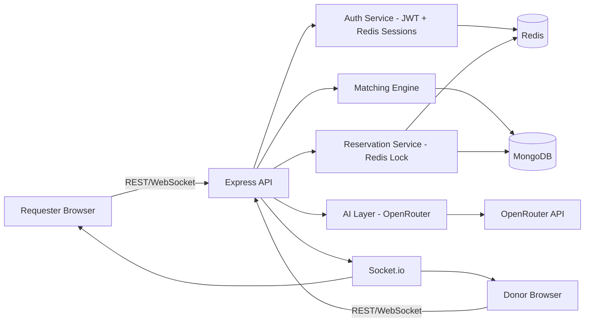

# LifeLine — High-Level Design (HLD)

## 1. System Architecture

## 2. Tech Stack
- **Frontend:** React + Vite + TypeScript, Tailwind CSS, React Router, Socket.io-client, Axios, React Hook Form, Context/Zustand for global state.
- **Backend:** Node.js + Express, Mongoose, Socket.io, jsonwebtoken, bcrypt, express-validator.
- **Database:** MongoDB Atlas — `2dsphere` geospatial index on user locations.
- **Sessions/Locking:** Redis (Upstash free tier or Render Redis add-on) — refresh-token session store *and* distributed reservation lock.
- **AI:** OpenRouter — single fetch-based wrapper, model swappable via env var, never a hard dependency for correctness.
- **Testing:** Jest — unit tests on blood-compatibility logic and a concurrency test on the reservation lock.
- **Deployment:** Frontend on Vercel, backend (+ Redis) on Render.

## 3. Components

### 3.1 Auth Service
- **Access token:** short-lived (15 min) JWT, stateless, sent via `Authorization` header.
- **Refresh token:** long-lived (7 days) opaque random string, stored server-side in Redis keyed by `sessionId`, delivered as an httpOnly secure cookie.
- **Why Redis, not just a longer-lived JWT:** a Redis-backed session can be revoked instantly (logout, "log out everywhere," suspicious activity) by deleting the key — a stateless JWT can't be revoked before it expires without a blocklist, which is exactly what this is.
- Refresh flow: access token expires → client calls `/auth/refresh` with the cookie → server validates the Redis session → issues a new access token and rotates the refresh token.
- Logout: delete the Redis session key immediately.

### 3.2 Matching Engine
Given a structured request (blood group, urgency, lat/lng), runs a MongoDB `$geoNear` geospatial query filtered by blood-compatibility and donor availability, sorted by distance then reliability score.

### 3.3 Reservation Service (core showcase)
Uses Redis `SET key value NX PX <ttl>` — an atomic set-if-not-exists-with-expiry — as the distributed lock when a Requester reserves a donor. This is the industry-standard Redis locking primitive: only one concurrent request can successfully set the key, so double-booking is structurally impossible, not just unlikely. On expiry (TTL) or explicit decline, the key is deleted/expires and the Matching Engine re-runs for the next candidate.

### 3.4 Escalation
For MVP, escalation is triggered either by real TTL expiry on the Redis lock or a manual "simulate no-response" action in the donor dashboard (deliberately simplified instead of a background scheduler, to keep solo/1-week scope realistic) — documented as a "Future Work: move to a queue-based scheduler at scale" item.

### 3.5 AI Layer (OpenRouter)
Two responsibilities: (1) parse free-text emergency descriptions into structured `{bloodGroup, urgency, location}` JSON, and (2) generate a one-line human-readable explanation for each ranked match. Both calls are wrapped with a deterministic fallback (keyword/regex extraction) so the app remains functional if OpenRouter is unavailable — AI is advisory, never authoritative, over the core matching decision.

### 3.6 Real-time Layer
Socket.io rooms per request ID; both requester and matched donor join. Status transitions (matched → reserved → confirmed/expired/escalated) and session-revocation notices are pushed as events rather than polled.

## 4. Key Architectural Trade-offs (viva defense)
| Decision | Choice | Alternative | Why |
|---|---|---|---|
| Session revocation | Redis-backed refresh sessions | Long-lived JWT only | Instant revocation vs. no revocation until natural expiry |
| Reservation lock | Redis `SET NX PX` | Mongo `findOneAndUpdate` + TTL index | True distributed lock primitive; the standard pattern for this exact problem |
| Escalation trigger | Manual trigger + real TTL expiry | Background queue/scheduler | Realistic for solo/1-week scope; explicitly the first thing to upgrade at scale |
| AI role | Advisory (parsing + explanation only) | AI makes the match decision | Keeps core correctness deterministic and testable |
| Frontend framework | Plain React + Vite | Next.js | Stays strictly within the MERN constraint |

## 5. Scalability Notes
- Matching queries → cache hot geospatial queries, add read replicas as volume grows.
- Escalation → move manual/TTL-only triggers to a message queue (BullMQ) once request volume exceeds what a manual/simple trigger can handle.
- Multi-region → Redis locking would need to move to a Redlock-style multi-node algorithm instead of single-instance locks.
