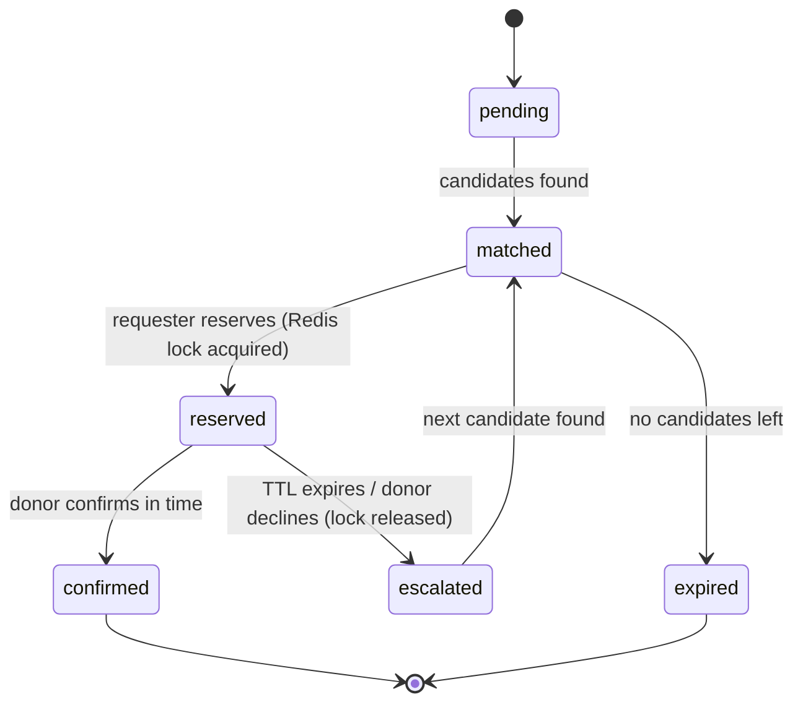

# LifeLine — Low-Level Design (LLD)

## 1. Relational PostgreSQL & MongoDB Schemas

### 1.1 PostgreSQL Schema (Prisma ORM)
```prisma
model DonorReference {
  id           String       @id @default(uuid())
  mongoDonorId String       @unique @map("mongo_donor_id")
  name         String
  bloodGroup   String       @map("blood_group")
  createdAt    DateTime     @default(now()) @map("created_at")
  updatedAt    DateTime     @updatedAt @map("updated_at")
  auditEvents  AuditEvent[]

  @@map("donors_reference")
}

model AuditEvent {
  id        String          @id @default(uuid())
  requestId String          @map("request_id")
  action    String
  actorId   String          @map("actor_id")
  donorId   String?         @map("donor_id")
  metadata  Json?
  timestamp DateTime        @default(now())
  donor     DonorReference? @relation(fields: [donorId], references: [id], onDelete: SetNull)

  @@map("audit_events")
}
```
**Foreign Key Relationship:** `audit_events.donor_id` ➔ `donors_reference.id` (`ON DELETE SET NULL`).

### 1.2 MongoDB Schemas

```js
User {
  _id, name, phone, email, passwordHash,
  role: "requester" | "donor",
  location: { type: "Point", coordinates: [lng, lat] }, // 2dsphere indexed
  createdAt
}

DonorProfile {
  _id, userId (ref User),
  bloodGroup: "O+" | "O-" | "A+" | "A-" | "B+" | "B-" | "AB+" | "AB-",
  lastDonationDate: Date,
  isAvailable: Boolean,
  reliabilityScore: Number,   // starts 100, -10 no-response, +2 confirmed
  status: "available" | "reserved" | "on_cooldown"
}

EmergencyRequest {
  _id, requesterId (ref User),
  rawText: String,
  parsed: { bloodGroup: String, urgency: "critical" | "high" | "moderate" },
  location: { type: "Point", coordinates: [lng, lat] },
  status: "pending" | "matched" | "reserved" | "confirmed" | "expired" | "escalated" | "cancelled",
  matchedCandidateIds: [ObjectId],
  currentLockKey: String,        // corresponding Redis lock key, if reserved
  escalationHistory: [{ donorId: ObjectId, outcome: "no_response" | "declined", timestamp: Date }],
  createdAt
}

AuditLog {
  _id, requestId, action, actorId, timestamp, metadata
}
```
Indexes: `User.location` → `2dsphere`; `DonorProfile` → compound `{ bloodGroup: 1, status: 1 }`.

## 2. Redis Keys

```
session:{sessionId}   -> { userId, refreshTokenHash }     TTL 7d
lock:donor:{donorId}  -> { requestId }                    TTL 15min
```

## 3. Core API Contracts

| Method | Route | Purpose |
|---|---|---|
| POST | `/api/v1/auth/signup` | Register user |
| POST | `/api/v1/auth/login` | Issue access token + refresh cookie, create Redis session |
| POST | `/api/v1/auth/refresh` | Validate Redis session, rotate refresh token, issue new access token |
| POST | `/api/v1/auth/logout` | Delete Redis session key |
| POST | `/api/v1/requests` | Submit free-text emergency request (triggers AI parse) |
| GET | `/api/v1/requests/:id/matches` | Get ranked donor matches + AI explanations |
| GET | `/api/v1/requests/:id/audit-trail` | Get audit trail via Prisma SQL JOIN (`audit_events` JOIN `donors_reference`) |
| POST | `/api/v1/requests/:id/reserve` | Acquire Redis lock on a donor |
| POST | `/api/v1/requests/:id/confirm` | Donor confirms reservation |
| POST | `/api/v1/requests/:id/decline` | Donor declines → releases lock, triggers escalation |
| POST | `/api/v1/donors/:id/availability` | Toggle donor availability |

## 4. Critical Algorithm — Redis-Locked Reservation

```js
async function reserveDonor(requestId, donorId, ttlSeconds = 900) {
  const lockKey = `lock:donor:${donorId}`;

  // Atomic set-if-not-exists with expiry — the standard Redis distributed lock primitive
  const acquired = await redisClient.set(lockKey, requestId, { NX: true, PX: ttlSeconds * 1000 });

  if (!acquired) {
    throw new ConflictError("Donor already reserved by another request");
  }

  await DonorProfile.findByIdAndUpdate(donorId, { status: "reserved" });
  await EmergencyRequest.findByIdAndUpdate(requestId, {
    status: "reserved",
    currentLockKey: lockKey
  });

  emitSocketEvent(requestId, "reserved", { donorId, expiresInSeconds: ttlSeconds });
  return { lockKey, donorId };
}
```
**Why this is race-condition-safe:** Redis is single-threaded for command execution, so `SET ... NX` is atomic — if two requests race to reserve the same donor, only one `SET` succeeds; the other gets a falsy result and throws a conflict immediately, with no window for a double-booking. When the key expires (TTL) or is explicitly deleted on decline, the donor becomes reservable again automatically.

## 5. PostgreSQL Prisma SQL JOIN Query Sample

```js
// GET /api/v1/requests/:id/audit-trail
async function getAuditTrailForRequest(requestId) {
  const prisma = getPrisma();
  
  // Real SQL JOIN query: audit_events JOIN donors_reference ON audit_events.donor_id = donors_reference.id
  const events = await prisma.auditEvent.findMany({
    where: { requestId: requestId.toString() },
    include: {
      donor: {
        select: {
          id: true,
          mongoDonorId: true,
          name: true,
          bloodGroup: true,
        },
      },
    },
    orderBy: { timestamp: 'asc' },
  });
  
  return events;
}
```

## 6. Auth Flow Detail

```js
// Login
async function login(email, password) {
  const user = await User.findOne({ email });
  if (!user || !(await bcrypt.compare(password, user.passwordHash))) throw new AuthError();

  const accessToken = jwt.sign({ userId: user._id }, process.env.JWT_SECRET, { expiresIn: "15m" });
  const refreshToken = crypto.randomBytes(40).toString("hex");
  const sessionId = crypto.randomUUID();

  await redisClient.set(`session:${sessionId}`, JSON.stringify({
    userId: user._id, refreshTokenHash: await bcrypt.hash(refreshToken, 10)
  }), { EX: 7 * 24 * 60 * 60 });

  // refreshToken + sessionId sent together as an httpOnly, secure cookie
  return { accessToken, sessionId, refreshToken };
}

// Refresh
async function refresh(sessionId, refreshToken) {
  const raw = await redisClient.get(`session:${sessionId}`);
  if (!raw) throw new AuthError("Session revoked or expired");

  const session = JSON.parse(raw);
  if (!(await bcrypt.compare(refreshToken, session.refreshTokenHash))) throw new AuthError();

  const newAccessToken = jwt.sign({ userId: session.userId }, process.env.JWT_SECRET, { expiresIn: "15m" });
  const newRefreshToken = crypto.randomBytes(40).toString("hex"); // rotation
  await redisClient.set(`session:${sessionId}`, JSON.stringify({
    userId: session.userId, refreshTokenHash: await bcrypt.hash(newRefreshToken, 10)
  }), { EX: 7 * 24 * 60 * 60 });

  return { newAccessToken, newRefreshToken };
}

// Logout
async function logout(sessionId) {
  await redisClient.del(`session:${sessionId}`);
}
```

## 7. Escalation State Machine



## 8. AI Layer Contract (OpenRouter)

```js
async function parseEmergencyText(rawText) {
  const res = await fetch("https://openrouter.ai/api/v1/chat/completions", {
    method: "POST",
    headers: {
      Authorization: `Bearer ${process.env.OPENROUTER_API_KEY}`,
      "Content-Type": "application/json"
    },
    body: JSON.stringify({
      model: process.env.OPENROUTER_MODEL,
      messages: [
        { role: "system", content: "Extract bloodGroup and urgency (critical|high|moderate) as strict JSON. No prose." },
        { role: "user", content: rawText }
      ],
      response_format: { type: "json_object" }
    })
  });
  const data = await res.json();
  return JSON.parse(data.choices[0].message.content);
}
```
Wrapped in try/catch with a deterministic keyword-extraction fallback if the call fails or times out.

## 9. Blood-Compatibility Logic
Pure function `isCompatible(donorGroup, requestGroup)` implementing the standard donor→recipient compatibility table (e.g. O- is a universal donor, AB+ accepts all groups). Kept isolated and unit-tested — the easiest, highest-value test to show in the repo.
