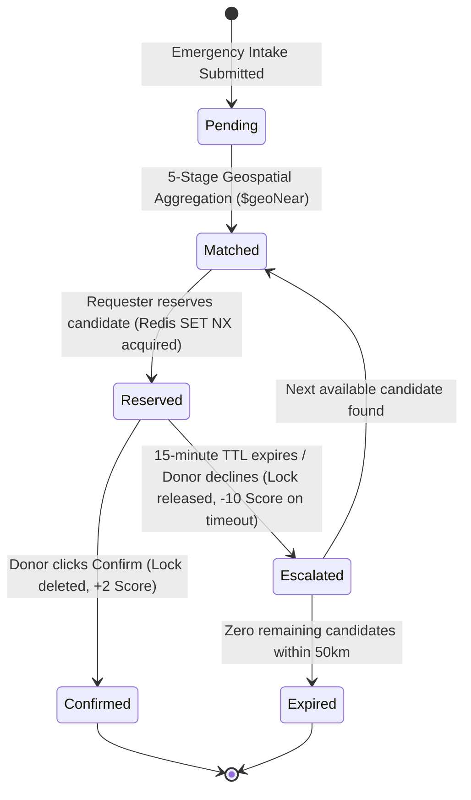

# LifeLine — Low-Level Design (LLD)

> **Document Version:** 1.2.0  
> **Author:** Mayank Sharma  
> **Status:** Approved / Production-Ready  
> **Core Concepts Demonstrated:** Relational schema design with PK/FK, SQL JOINs, Schema modeling (Mongo), Aggregation pipelines, RESTful endpoint design, Caching with Redis

---

## 1. Polyglot Database Schemas & Data Modeling

### 1.1 PostgreSQL Relational Schema (Prisma ORM)

```prisma
datasource db {
  provider = "postgresql"
  url      = env("DATABASE_URL")
}

generator client {
  provider = "prisma-client-js"
}

// Concept: Relational schema design with PK/FK & Normalization basics (3NF)
model DonorReference {
  id           String       @id @default(uuid())
  mongoDonorId String       @unique @map("mongo_donor_id")
  name         String
  bloodGroup   String       @map("blood_group")
  createdAt    DateTime     @default(now()) @map("created_at")
  updatedAt    DateTime     @updatedAt @map("updated_at")
  auditEvents  AuditEvent[]

  @@map("donors_reference")
}

// Concept: Relational schema design with PK/FK (1:N Relationship)
model AuditEvent {
  id        String          @id @default(uuid())
  requestId String          @map("request_id")
  action    String
  actorId   String          @map("actor_id")
  donorId   String?         @map("donor_id")
  metadata  Json?
  timestamp DateTime        @default(now())
  donor     DonorReference? @relation(fields: [donorId], references: [id], onDelete: SetNull)

  @@map("audit_events")
}
```

- **Primary Keys:** UUID v4 strings generated via `@default(uuid())`.
- **Foreign Key Constraint:** `audit_events.donor_id` references `donors_reference.id` with `onDelete: SetNull` (if a donor profile reference is purged, historical audit events are preserved with `donor_id = null`).
- **Indexes:** Unique index on `mongo_donor_id` and B-tree foreign key index on `donor_id`.

---

### 1.2 MongoDB Document Schemas (Mongoose)

#### `User` Schema
```js
const userSchema = new mongoose.Schema({
  name:         { type: String, required: true },
  phone:        { type: String, required: true, unique: true },
  email:        { type: String, required: true, unique: true },
  passwordHash: { type: String, required: true },
  role:         { type: String, enum: ['requester', 'donor'], required: true },
  // Concept: Schema modeling (Mongo) — GeoJSON 2D Point
  location: {
    type:        { type: String, enum: ['Point'], default: 'Point' },
    coordinates: { type: [Number], required: true }, // [longitude, latitude]
  },
  createdAt:    { type: Date, default: Date.now },
});

// Concept: Indexing for query performance (Mongo) — 2dsphere spatial index
userSchema.index({ location: '2dsphere' });
```

#### `DonorProfile` Schema
```js
const donorProfileSchema = new mongoose.Schema({
  userId:           { type: mongoose.Schema.Types.ObjectId, ref: 'User', required: true, unique: true },
  bloodGroup:       { type: String, enum: ['O+', 'O-', 'A+', 'A-', 'B+', 'B-', 'AB+', 'AB-'], required: true },
  lastDonationDate: { type: Date, default: null },
  isAvailable:      { type: Boolean, default: true },
  reliabilityScore: { type: Number, default: 100, min: 0, max: 100 },
  status:           { type: String, enum: ['available', 'reserved', 'on_cooldown'], default: 'available' },
});

// Concept: Indexing for query performance (Mongo) — Compound index
donorProfileSchema.index({ bloodGroup: 1, status: 1 });
```

#### `EmergencyRequest` Schema
```js
const emergencyRequestSchema = new mongoose.Schema({
  // Concept: Embedding vs referencing — ObjectId reference to User
  requesterId: { type: mongoose.Schema.Types.ObjectId, ref: 'User', required: true },
  rawText:     { type: String, required: true },
  // Concept: Embedding vs referencing — Embedded subdocument
  parsed: {
    bloodGroup: { type: String },
    urgency:    { type: String, enum: ['critical', 'high', 'moderate'], default: 'moderate' },
  },
  location: {
    type:        { type: String, enum: ['Point'], default: 'Point' },
    coordinates: { type: [Number], required: true }, // [longitude, latitude]
  },
  status: {
    type: String,
    enum: ['pending', 'matched', 'reserved', 'confirmed', 'expired', 'escalated', 'cancelled'],
    default: 'pending',
  },
  matchedCandidateIds: [{ type: mongoose.Schema.Types.ObjectId, ref: 'DonorProfile' }],
  currentLockKey:      { type: String, default: null },
  // Concept: Embedding vs referencing — Embedded array for atomic timeline updates
  escalationHistory: [
    {
      donorId:   { type: mongoose.Schema.Types.ObjectId, ref: 'DonorProfile' },
      outcome:   { type: String, enum: ['no_response', 'declined'] },
      timestamp: { type: Date, default: Date.now },
    },
  ],
}, { timestamps: { createdAt: true, updatedAt: false } });

emergencyRequestSchema.index({ location: '2dsphere' });
emergencyRequestSchema.index({ requesterId: 1, status: 1 });
```

#### `AuditLog` Schema (MongoDB Fallback)
```js
const auditLogSchema = new mongoose.Schema({
  requestId: { type: mongoose.Schema.Types.ObjectId, ref: 'EmergencyRequest' },
  action:    { type: String, required: true },
  actorId:   { type: mongoose.Schema.Types.ObjectId, ref: 'User' },
  timestamp: { type: Date, default: Date.now },
  metadata:  { type: mongoose.Schema.Types.Mixed, default: {} },
});

auditLogSchema.index({ requestId: 1, timestamp: -1 });
```

---

## 2. In-Memory Redis Key Architecture

| Key Pattern | Data Type | Value / Payload | TTL Policy | Purpose |
|---|---|---|---|---|
| `session:<sessionId>` | String (JSON) | `{"userId": "...", "refreshTokenHash": "..."}` | `604800` (7 days) | Server-side refresh session validation and instant revocation. |
| `lock:donor:<donorProfileId>` | String | `<requestId>` | `900` (15 minutes) | Distributed atomic reservation lock preventing concurrent bookings. |

---

## 3. Core Algorithms & Code Implementations

### 3.1 MongoDB 5-Stage Geospatial Aggregation Pipeline
**Location:** [`server/src/services/matchingService.js`](file:///c:/Users/mayan/lifeline/server/src/services/matchingService.js)

```js
async function findCandidates(location, bloodGroup, maxDistance = 50000) {
  const compatibleGroups = getCompatibleDonorGroups(bloodGroup);
  if (!compatibleGroups.length) return [];

  const results = await User.aggregate([
    // Stage 1: Geospatial proximity sort on User.location (2dsphere index)
    {
      $geoNear: {
        near: location,
        distanceField: 'distanceMetres',
        maxDistance: maxDistance,
        spherical: true,
        query: { role: 'donor' },
      },
    },
    // Stage 2: Join with DonorProfile collection
    {
      $lookup: {
        from: 'donorprofiles',
        localField: '_id',
        foreignField: 'userId',
        as: 'profile',
      },
    },
    // Stage 3: Deconstruct joined array
    { $unwind: '$profile' },
    // Stage 4: Filter by availability and biological blood compatibility
    {
      $match: {
        'profile.status': 'available',
        'profile.isAvailable': true,
        'profile.bloodGroup': { $in: compatibleGroups },
      },
    },
    // Stage 5: Multi-variable sort: Distance ASC, Reliability Score DESC
    {
      $sort: {
        distanceMetres: 1,
        'profile.reliabilityScore': -1,
      },
    },
    { $limit: 10 },
    // Stage 6: Project sanitized candidate payload
    {
      $project: {
        _id: 0,
        donorProfileId: '$profile._id',
        userId: '$_id',
        name: '$name',
        bloodGroup: '$profile.bloodGroup',
        distanceMetres: { $round: ['$distanceMetres', 0] },
        reliabilityScore: '$profile.reliabilityScore',
      },
    },
  ]);

  return results;
}
```

---

### 3.2 Redis Distributed Lock & Atomic Reservation
**Location:** [`server/src/services/reservationService.js`](file:///c:/Users/mayan/lifeline/server/src/services/reservationService.js)

```js
async function reserveDonor(requestId, donorProfileId, actorUserId, ttl = 900) {
  const lockKey = `lock:donor:${donorProfileId}`;
  const redis = getRedis();

  // Concept: Caching with Redis — Atomic SET lockKey requestId NX PX <ttl_ms>
  const acquired = await redis.set(lockKey, requestId.toString(), {
    nx: true,
    px: ttl * 1000,
  });

  if (!acquired) {
    const err = new Error('Donor already reserved by another request');
    err.status = 409; // HTTP 409 Conflict
    throw err;
  }

  // Update donor profile and emergency request state
  await DonorProfile.findByIdAndUpdate(donorProfileId, { status: 'reserved' });
  await EmergencyRequest.findByIdAndUpdate(requestId, {
    status: 'reserved',
    currentLockKey: lockKey,
  });

  // Record audit log and emit real-time WebSocket events
  await recordAuditEvent({
    requestId,
    action: 'reserve',
    actorId: actorUserId,
    donorProfileId,
    metadata: { lockKey, ttlSeconds: ttl },
  });

  emitSocketEvent(requestId, 'reserved', { donorProfileId, expiresInSeconds: ttl });
  return { lockKey, donorProfileId };
}
```

---

### 3.3 PostgreSQL Prisma Relational SQL JOIN
**Location:** [`server/src/services/auditService.js`](file:///c:/Users/mayan/lifeline/server/src/services/auditService.js)

```js
async function getAuditTrailForRequest(requestId) {
  const prisma = getPrisma();
  
  // Concept: SQL JOINs — Generates SQL LEFT JOIN audit_events ON donors_reference
  const events = await prisma.auditEvent.findMany({
    where: { requestId: requestId.toString() },
    include: {
      donor: {
        select: {
          id: true,
          mongoDonorId: true,
          name: true,
          bloodGroup: true,
        },
      },
    },
    orderBy: { timestamp: 'asc' }, // Concept: Filtering, ordering, grouping
  });

  return events;
}
```

---

## 4. RESTful API Route Specifications

| Method | Endpoint | Auth | Request Body | Success Response | Error Codes |
|---|---|---|---|---|---|
| `POST` | `/api/v1/auth/signup` | Public | `{ name, phone, email, password, role, bloodGroup? }` | `201 Created` `{ accessToken, user }` | `400`, `409` |
| `POST` | `/api/v1/auth/login` | Public | `{ email, password }` | `200 OK` `{ accessToken, user }` | `400`, `401` |
| `POST` | `/api/v1/auth/refresh` | Cookie | *(Cookie `refresh_session`)* | `200 OK` `{ accessToken }` | `401` |
| `POST` | `/api/v1/auth/logout` | Bearer | *(Empty)* | `200 OK` `{ message: "Logged out" }` | `401` |
| `GET` | `/api/v1/auth/me` | Bearer | *(Empty)* | `200 OK` `{ user }` | `401`, `404` |
| `POST` | `/api/v1/requests` | Bearer | `{ rawText, location: { lat, lng } }` | `201 Created` `{ requestId, parsed, candidates }` | `400`, `401` |
| `GET` | `/api/v1/requests/:id` | Bearer | *(Empty)* | `200 OK` `{ request }` | `401`, `404` |
| `POST` | `/api/v1/requests/:id/reserve` | Bearer | `{ donorProfileId }` | `200 OK` `{ lockKey, donorProfileId }` | `401`, `404`, `409` |
| `POST` | `/api/v1/requests/:id/confirm` | Bearer | `{ donorProfileId }` | `200 OK` `{ status: "confirmed" }` | `401`, `409` |
| `POST` | `/api/v1/requests/:id/decline` | Bearer | `{ donorProfileId, outcome }` | `200 OK` `{ nextCandidate }` | `401`, `404` |
| `GET` | `/api/v1/requests/:id/audit-trail` | Bearer | *(Empty)* | `200 OK` `Array<AuditEvent>` | `401`, `404` |
| `GET` | `/api/v1/donors/me` | Bearer | *(Empty)* | `200 OK` `{ profile, activeReservation }` | `401`, `403` |
| `POST` | `/api/v1/donors/availability` | Bearer | `{ isAvailable }` | `200 OK` `{ profile }` | `400`, `401` |

---

## 5. Escalation & Lifecycle State Machine


